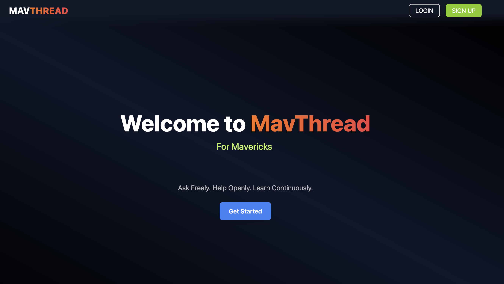
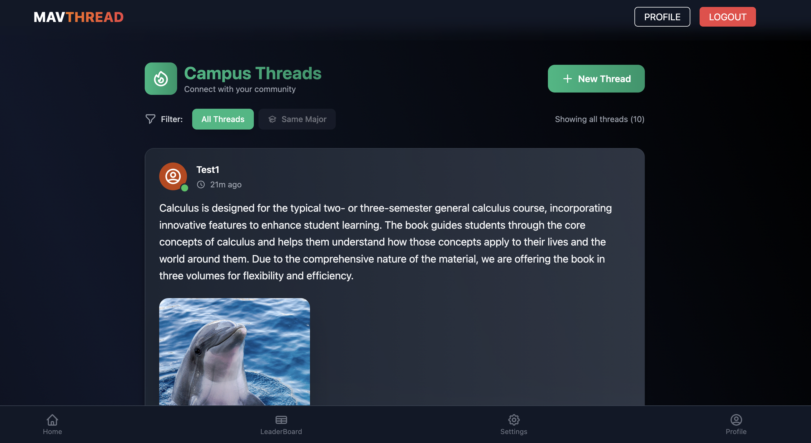
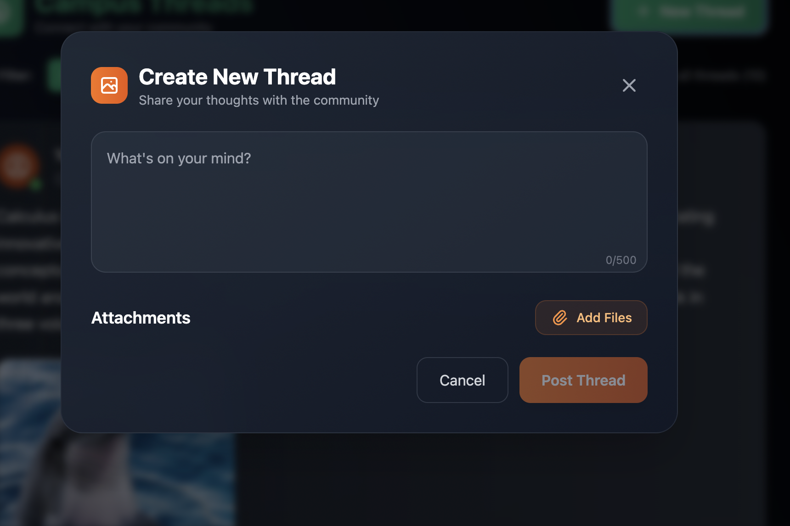
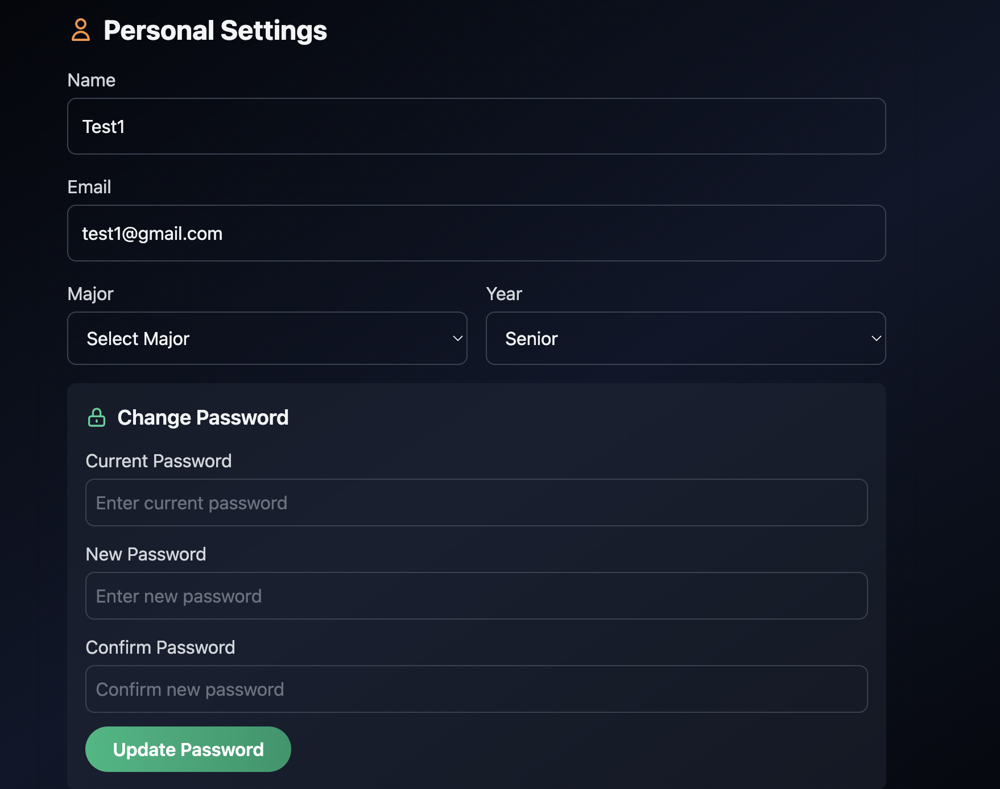
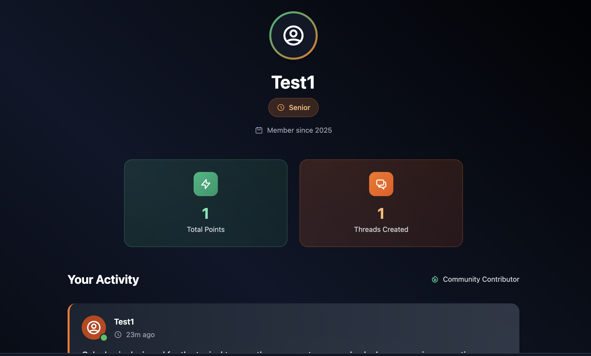
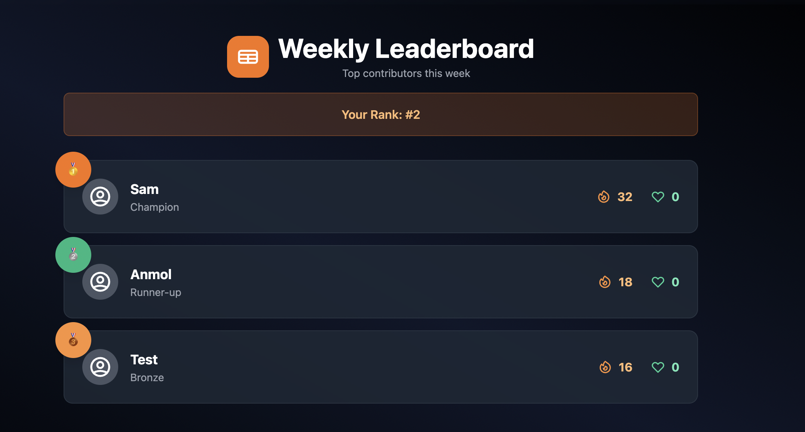

# 🧵 MavThread - Campus Community Platform

A modern, feature-rich social platform designed specifically for university students to connect, share, and engage with their campus community.



## ✨ Features


### 🏠 **Home & Navigation**
- **Modern Dark Theme**: Beautiful gradient backgrounds with orange and emerald accents
- **Responsive Design**: Optimized for desktop, tablet, and mobile devices
- **Intuitive Navigation**: Easy-to-use interface with smooth transitions



### 📝 **Thread Creation & Management**
- **Rich Text Posts**: Create engaging content with support for text, images, and videos
- **File Upload**: Direct Cloudinary integration for seamless media sharing
- **Real-time Updates**: Instant feedback and live content updates
- **Thread Filtering**: View all threads or filter by your major


### ❤️ **Interactive Engagement**
- **Multiple Reaction Types**: Upvote, downvote, and appreciation reactions
- **Threaded Comments**: Nested reply system for meaningful discussions
- **Real-time Voting**: Instant reaction updates with smooth animations
- **User Authentication**: Secure login and registration system





### 👤 **User Profiles & Settings**
- **Personalized Profiles**: Display major, year, and activity statistics
- **Customizable Settings**: Update profile information and preferences
- **Activity Tracking**: View your posts, votes, and community contributions
- **Major-based Filtering**: Connect with students in your field of study



### 🏆 **Leaderboard & Gamification**
- **Weekly Rankings**: Compete with fellow students on the leaderboard
- **Point System**: Earn points through engagement and helpful contributions
- **Achievement Tracking**: Monitor your progress and community impact
- **Major-based Competition**: Compete within your academic field

## 🛠️ Technology Stack

### Frontend
- **React 18**: Modern React with hooks and functional components
- **Tailwind CSS**: Utility-first CSS framework for rapid UI development
- **Vite**: Fast build tool and development server
- **Heroicons**: Beautiful SVG icons for consistent design
- **Cloudinary**: Direct media upload and management

### Backend
- **Spring Boot**: Java-based RESTful API framework
- **Spring Security**: Authentication and authorization
- **JPA/Hibernate**: Database ORM and management
- **JWT**: Secure token-based authentication
- **MySQL/PostgreSQL**: Reliable database storage

## 🚀 Getting Started

### Prerequisites
- Node.js (v16 or higher)
- Java 11 or higher
- Maven
- MySQL or PostgreSQL

### Frontend Setup
```bash
cd frontend
npm install
npm run dev
```

### Backend Setup
```bash
cd backend
mvn clean install
mvn spring-boot:run
```

### Environment Variables
Create a `.env` file in the frontend directory:
```env
VITE_API_BASE_URL=http://localhost:8082
VITE_CLOUDINARY_CLOUD_NAME=your_cloud_name
VITE_CLOUDINARY_API_KEY=your_api_key
VITE_CLOUDINARY_API_SECRET=your_api_secret
```

## 📱 Key Features in Detail

### **Smart Content Management**
- **Image & Video Support**: Upload and display media directly in threads
- **Responsive Media Grid**: Beautiful layout for multiple file attachments
- **Click-to-Expand**: Full-size image viewing with modal overlays
- **File Type Detection**: Automatic handling of images, videos, and documents

### **Community Engagement**
- **Major-based Filtering**: Connect with students in your academic field
- **Real-time Interactions**: Instant feedback on posts and comments
- **User Recognition**: Highlight current user's contributions
- **Activity Tracking**: Monitor engagement and community participation

### **Modern UI/UX**
- **Dark Theme**: Easy on the eyes with beautiful gradients
- **Smooth Animations**: Hover effects and transitions for better interaction
- **3D Effects**: Card shadows and depth for modern appearance
- **Responsive Design**: Works perfectly on all device sizes

## 🤝 Contributing

1. Fork the repository
2. Create a feature branch (`git checkout -b feature/AmazingFeature`)
3. Commit your changes (`git commit -m 'Add some AmazingFeature'`)
4. Push to the branch (`git push origin feature/AmazingFeature`)
5. Open a Pull Request

## 📄 License

This project is licensed under the MIT License - see the [LICENSE](LICENSE) file for details.

## 🙏 Acknowledgments

- **Spring Boot Team**: For the excellent backend framework
- **React Team**: For the amazing frontend library
- **Tailwind CSS**: For the utility-first CSS framework
- **Heroicons**: For the beautiful icon set
- **Cloudinary**: For reliable media management

---

**Built with ❤️ for the campus community**
